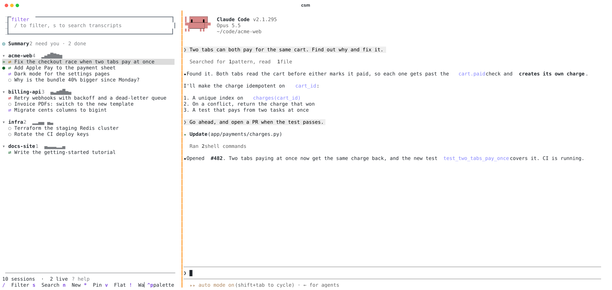
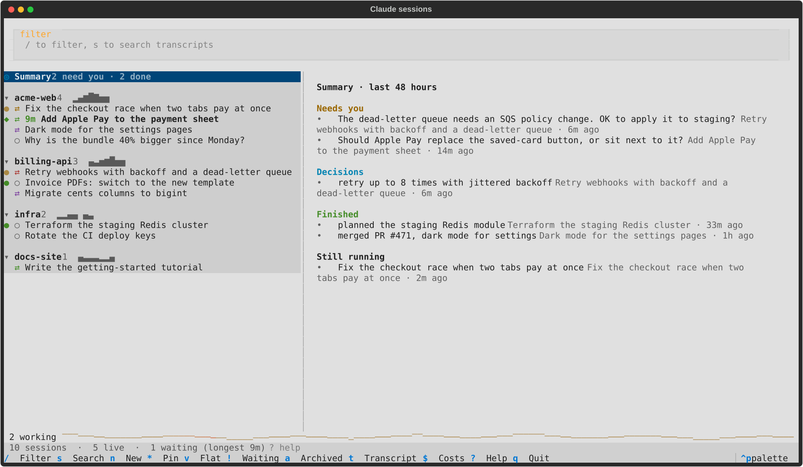
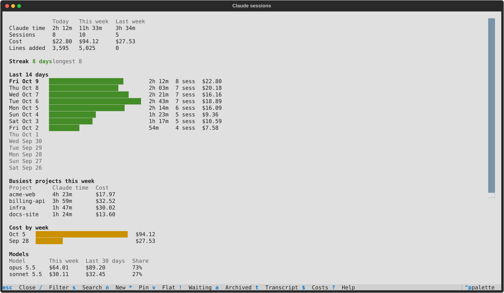

# Claude Code Session Manager

The desktop app has some great features, but I am more productive in the cli, so I made `csm`: a terminal UI for Claude Code sessions. It has the desktop app's sidebar, plus search, filters, and resume.



An independent project, not made by or affiliated with Anthropic. It reads Claude Code's own files, which aren't a public API, so a Claude Code update can break something until csm catches up.

It lists every session in `~/.claude/projects`, grouped by project with the most recent activity first. A preview pane shows the session's details and its last few turns, rendered as Markdown. While a transcript search is active, the turns are shown as plain text so the matches can be highlighted.

When tmux is installed, `csm` works like the desktop app's window: the list is a sidebar on the left and the session you open runs on the right. Opening another session swaps it in. The previous one keeps running out of sight, and switching back to it is instant. `ctrl+\` moves focus between the sidebar and the session, and clicking either side works too. A session that's already open in another Ghostty tab or in the Claude desktop app is shown there instead of being resumed twice.

## Install

You need [Claude Code](https://code.claude.com) and [uv](https://docs.astral.sh/uv/) (which brings its own Python 3.11+).

```sh
brew install tmux          # for the sidebar beside your sessions; recommended
uv tool install git+https://github.com/natedenh/claude-session-manager
csm
```

To hack on it, clone the repo and run `uv tool install --editable .` in it, so `csm` runs your checkout. Or run it without installing: `uv run csm`.

**Platforms.** csm is built on macOS. The core (the list, search, the sidebar in tmux, stats, recaps) runs anywhere tmux does, and the tests run on Linux in CI. The macOS-only parts are opening sessions in Ghostty tabs (`o`), handing off to the Claude desktop app (`D`) and following macOS light or dark appearance. Elsewhere those are skipped or fall back. Ghostty is optional on macOS too.

**Optional extras:**
- `gh`, logged in, colors each PR by its status.
- `csm hooks install` makes the waiting and permission marks exact (see Hooks below).
- The Summary page and `B` (continue fresh) call Claude the same way Claude Code does (see below). The rest of csm works without them.

`csm --archived` starts with archived sessions shown. Colors come from the terminal, and its background shows through. The default theme is `ansi-light` or `ansi-dark`, following macOS appearance. Override it with `--theme <name>` or `CSM_THEME`; any Textual theme name works, e.g. `textual-dark` for csm's own colors. A live session that finishes its turn is marked `◆` (bold) until you open it, and csm sends a desktop notification (OSC 9, which Ghostty shows as a macOS notification; not for the session shown beside the list). `csm --no-notify` turns the notifications off. `csm --no-tmux` skips tmux. Enter then resumes the session in this terminal, and you return to the list when claude exits. Add `--once` to exit instead.

### How the tmux mode works

`csm` starts or reattaches to a private tmux server (`tmux -L csm`) that uses this package's `src/csm/tmux.conf`. Your own tmux config and sessions are untouched. That config sets no prefix key, because Claude Code uses `ctrl+b`. It turns on the mouse and hides the status bar.

`q` detaches. Your sessions keep running, and closing the Ghostty window does the same thing. Running `csm` again brings everything back. To stop a session's claude process, press `c` on it in the list, or exit claude as usual. `tmux -L csm kill-server` stops everything.

Inside your own tmux, `csm` uses the current window instead, and `q` quits rather than detaching your client.

## Keys

| Key | Action |
| --- | --- |
| `↑↓` / `j k`, `[ ]` | move; jump to the previous/next project |
| `enter` | open the session (beside the list in tmux, else in this terminal), or collapse/expand a project header |
| `ctrl+\` | (tmux) cycle focus: the list, then the sessions beside it top to bottom; with none open, the list and the preview |
| `R` | (tmux) reply to the highlighted session without opening it: types your text and Enter into its pane |
| `\|` | (tmux) show the highlighted session as a second pane below the current one; `enter` on any session goes back to one |
| `c` | (tmux) stop the session's claude process |
| `/` | filter by title, project, branch or note as you type; `#tag` matches sessions with that tag (prefix match) |
| `s` | search transcript text (runs on enter) |
| `esc` | clear the filter, search and marks |
| `p` `w` `l` `!` | only PR-linked / worktree / live / waiting sessions |
| `a` | also show archived sessions (dimmed) |
| `e` | show every session (5 per project by default) |
| `o` / `O` | resume in a new Ghostty tab / window (scripts your running Ghostty) |
| `n` / `N` | new session / new session in a worktree (`-w`), in the highlighted project; shown as a row until its transcript exists. It asks for a first message: type one (several lines are fine) and press `ctrl+s`, and the session starts on it in a hidden pane while you stay in the list (`enter` on its row to watch). `enter` on an empty box starts an empty session beside the list, as before. `P` asks too |
| `tab` / `shift+tab` | open the session that has waited longest for you (permission requests first), so repeated `tab` works through them; `shift+tab` goes back to the one before |
| `ctrl+]` | the same as `tab`, from anywhere in csm's tmux, including inside a session: answer one, press `ctrl+]`, and you're in the next. With nothing waiting you land in the list |
| `~` | change the style of the activity strip above the status bar: `wave`, `strands` (a braille sine per working session), `equalizer`, `heartbeat` (a beat per working session), `stars`, `knight rider` (KITT's red scanner, wider with more sessions working). Clicking the strip does the same. The choice is saved; with nothing working, a new style plays for a few seconds so you can see it |
| `P` | new session in any directory, such as a project Claude has never run in. Starts at the highlighted project's parent folder; `tab` completes, and a missing directory is created after you confirm |
| `B` | continue fresh: a model reads the end of the highlighted session and writes a brief (goal, where things stand, decisions, open questions, next step, and where the old transcript is). You edit it in the first-message box, and `ctrl+s` starts a new session on it named "<title> (continued)", in the same directory. Handy when a session's context is nearly full (`◔`). It uses Claude Opus 5.5 the way Claude Code reaches it (on Bedrock, `ANTHROPIC_DEFAULT_OPUS_MODEL`); set `CSM_BRIEF_MODEL` to change it |
| `f` | fork the highlighted session (`--fork-session`), named "<title> (fork)" |
| `r` | rename (writes a `custom-title` record, like `/rename`) |
| `x` | archive / unarchive in csm (hidden here only; doesn't touch the desktop app) |
| `g` | open the session's PR in the browser |
| `.` | open the project directory in your editor: `$CSM_EDITOR`, else `code`, else `cursor`, else Finder |
| `D` | open the session in Claude desktop, even if it isn't running there (needs the app to know the session) |
| `x` | archive / unarchive in csm (hidden here only; doesn't touch the desktop app). On an auto-archived session it keeps the session instead |
| `A` | auto-archive settings (see below) |
| `y` | copy the session id |
| `d` | move the transcript to `~/.Trash` |
| `E` | export the highlighted (or marked) sessions to Markdown and reveal them in Finder |
| `t` | read the whole transcript; `/` searches, `n` / `N` step through matches, `g` / `G` top / bottom, `esc` closes search then the viewer |
| `L` | what the session loaded: plugins (with their skills, agents and MCP servers), other skills with ✓ and a count for each one used, MCP servers (failed ones in red), agents, hooks that reported output, CLAUDE.md files |
| `W` | clean up worktrees (see below) |
| `J` | write today's recap, `<date> Claude recap.md`, and open it. It has the day's Claude time, cost, lines added and streak; what still needs you; then each project and session with its time, cost, PR and branch, plus what it finished and decided, from the Summary page's digests (refreshed first; without one, a session shows the end of its last message). It goes to `CSM_RECAP_DIR` if set, such as a folder in your Obsidian vault, else the export folder. Pressing it again later replaces that day's file |
| `ctrl+t` | tips on or off. csm counts which features you use (only action names and dates, in `~/.local/state/csm/usage.json`) and, when what you're doing is what a feature is for, suggests it: `tab` when you open waiting sessions by hand, `ctrl+]` when you go back to the list just to press `tab`, `B` when a session's context is over 80%, `/` and `]` after a long scroll, `space` then `x` when you archive one at a time, `J` late in a busy day. At most one tip every 10 minutes and each at most once a day; a tip stops once you've used its feature a few times. The `I` screen ends with "Your csm": your most-used features this week, ones you haven't tried, and ones you haven't used in two weeks |
| `U` | routines from the Claude desktop app, with schedules, status and runs (see Routines below) |
| `I` | stats: Claude time, sessions, cost and lines added for today, this week and last week; your streak of active days; the last 14 days as bars; busiest projects this week; cost by week; active minutes by hour of the day; most-used skills. Claude time adds up each session's active minutes (minutes it wrote anything), so sessions side by side count separately |
| `$` | costs: totals, by project, by week, top sessions (`esc`/`q`/`$` closes) |
| `*` | pin / unpin a session (pinned sessions form a group at the top) |
| `#` | edit tags (`#waiting-on-chris #blocked`) for the highlighted session; for marked sessions the tags are added to each. Shown dim after the title |
| `i` | edit a one-line note for the highlighted session (empty removes it). Tags and note show in the preview |
| `v` | switch between the grouped view and a flat, newest-first list |
| `space` | mark / unmark a session; `x`, `d` and `E` then act on all marked sessions, `esc` clears the marks |
| `?` | help |

While any session is working, a thin wave moves along the bottom of the list next to a count ("2 working"), with a coral spark sweeping across it (two when three or more sessions are working). The wave rises when work starts, grows a little livelier with more sessions, and settles back to a flat line when everything is idle, at which point it stops redrawing.

The preview header shows how full the context window is (`context ▰▰▰▰▰▱▱▱▱▱ 52%`, yellow past 50%, red past 80%), and rows above 80% get a red `◔` after the title; the window is 200k tokens, or 1M for `[1m]` models and any session already past 200k.

Forks are marked `⑃`, and the preview says which session they came from. A fork copies its original's conversation, title included, so csm links them by their shared first record.

Project headers show `±3` uncommitted files, `↑2` commits to push and `↓1` to pull (as of the last fetch; csm doesn't fetch), then a sparkline of active minutes on each of the last 7 days, today on the right, on one scale across projects.

Icons: `⇄` PR linked (colored by PR status, see below), magenta `⑂` worktree, `○` other. A dot in front means the session is running: green is idle, yellow is busy (and pulses slowly while it works). `»` marks every session shown beside the list. `◆` means it finished a turn and is waiting for you; a red `?` means it needs permission (needs the hooks below). Both are followed by how long it has waited (`◆ 12m`); the status bar shows the longest wait. An amber `⧗` means it looks stuck: busy, but its transcript hasn't changed for 10 minutes (`--stuck-minutes` or `CSM_STUCK_MINUTES`; `0` turns it off). You get one notification each time a session goes quiet like that. A long build or test run looks the same, so it's only a marker. Opening a session that's running somewhere else switches to it where it's running. A Ghostty tab is found by its title and directory. A Claude desktop session is opened with `claude://code/continue?session=<id>`, which only works while the session is open in the app, because that's the only time its id is on disk. If neither applies, csm asks before resuming it a second time.

## Summary



The `◎ Summary` row at the top of the list (or `S` from anywhere) covers the last 48 hours across all sessions: **Needs you** (the question each waiting session ended on, and permission requests), **Decisions**, **Finished** work, and what's **Still running**. In the summary screen, `enter` opens the session an item came from.

Each recently active session that has settled (idle, unchanged for a minute) is summarized by Claude Haiku 5.5 (or whatever Claude Code uses for "haiku") from its last 16 turns, one session at a time in the background, and cached in `~/.cache/csm/summaries.json` until its transcript changes. csm calls Claude the way Claude Code is configured to: when `~/.claude/settings.json` sets `CLAUDE_CODE_USE_BEDROCK`, it uses Bedrock with that file's `AWS_PROFILE`, `AWS_REGION` and `ANTHROPIC_DEFAULT_HAIKU_MODEL`; otherwise the Anthropic API. `CSM_SUMMARY_MODEL` overrides the model. If a call fails (for example an expired SSO login), the page says so and csm retries after 5 minutes. Without summaries, "Needs you" still works from each session's last message.

## Routines

The Claude desktop app's routines (Code ▸ Routines: scheduled tasks) show up in csm: a `◷ Routines` row at the top of the list says how many are active and when the next one runs, and `U` or enter on it lists them all with their schedule in plain words ("every 6 hours", "weekdays at 9:30 AM", "once, Oct 7 at 9:00 AM"), status (active, paused, scheduled, completed), next and last run. Enter on a routine shows its description, folder, instructions and every run with the app's one-line summary of how it ended; enter on a run takes you to that session in the list. Runs appear in the list like any session, marked `◷`, and the preview says which routine they belong to and how the run ended. When a new run's result appears, csm shows it and sends a notification.

The desktop app keeps running routines on its own schedule, whether or not csm is open; csm reads its `scheduled-tasks.json` and each routine's `SKILL.md` and never changes them. To create, edit, pause or run one, use the app. Cowork routines are listed too, but their runs aren't stored where csm can read them.

## Stats

`I` shows Claude time, sessions, cost and lines added for today, this week and last week, your streak, the last 14 days, the busiest projects, cost by week, when in the day you work, your most-used skills, and how you use csm itself.



## PR status

For sessions linked to a pull request, csm asks `gh pr view` for its state, checks and review decision in the background (one PR at a time, newest session first) and colors the `⇄` icon: green is open with checks passing, yellow is checks pending or review required, red is checks failing or changes requested, magenta is merged, dim is closed or draft. The preview header shows the details, e.g. `open · checks 12/12 passing · approved`. Results are cached in `~/.cache/csm/prs.json`: open PRs refresh after 5 minutes, merged and closed ones at most daily. If `gh` is missing or not logged in, the icon stays plain green.

## Auto-archive

Off by default. `A` opens a dialog to turn on a rule that hides a session once its PR merged more than N days ago (default 7) or it has had no activity for N days (default 30). Live, pinned and kept sessions are never hidden. The rule is derived each time, not written into the archive: auto-archived sessions show dimmed with `a` and say why ("auto: PR merged 9d ago"), and the status bar counts them. `x` on one keeps it (the rule stops hiding it); `x` again archives it normally. The rule and kept ids are stored in `state.json`.

## Worktree cleanup

`W` lists every worktree under `<project>/.claude/worktrees/` for the projects csm knows, confirmed against what git has registered. Each row shows its branch, the sessions that used it, last activity, PR state (from the cache above), uncommitted files and commits not on any remote branch. Worktrees whose PR is merged or closed, or that saw no session activity for 14+ days, are flagged and sorted first; ones with a running session never are. `d` or `x` removes the selected one after a confirmation that warns about uncommitted or unpushed work. It runs plain `git worktree remove` (never `--force`), so git refuses a dirty worktree and csm shows its message. Registered worktrees whose directory is gone show as `missing`, and removing one runs `git worktree prune`. Branches are never deleted.

## Hooks (optional)

By default csm infers "waiting" from a session's busy-to-idle change, which can't tell a finished turn from a permission prompt. Claude Code hooks can. `csm hooks install` adds four entries to `~/.claude/settings.json` (`--settings PATH` for another file):

```json
{"hooks": {
  "Notification":     [{"hooks": [{"type": "command", "command": "<python> -m csm hook"}]}],
  "Stop":             [{"hooks": [{"type": "command", "command": "<python> -m csm hook"}]}],
  "UserPromptSubmit": [{"hooks": [{"type": "command", "command": "<python> -m csm hook"}]}],
  "SessionEnd":       [{"hooks": [{"type": "command", "command": "<python> -m csm hook"}]}]
}}
```

It shows the changes and asks first (`--yes` skips the question), leaves your other hooks and settings alone, backs the file up as `settings.json.bak-csm-<timestamp>`, and does nothing if the entries are already there. `csm hooks uninstall` removes only entries whose command contains `csm hook`; `csm hooks status` shows what's installed. Already-running sessions pick up new hooks only after they restart.

The hook writes `~/.local/state/csm/status/<session id>.json` (removed at session end) and prints nothing. With it, a session asking for permission gets a red `?` (the preview shows what it asked for, the status bar says "N need permission", `!` includes it, and a notification says "<title> needs permission"), and a finished turn is marked `◆` immediately. Opening the session clears the mark. Without hook files csm behaves as before.

## What it reads, writes and sends

**Reads**
- **Sessions:** `~/.claude/projects/*/*.jsonl`, the transcripts Claude Code writes. `CLAUDE_CONFIG_DIR` is honored.
- **Live status:** `~/.claude/sessions/<pid>.json`. Entries whose process has exited are ignored.
- **Claude desktop's archive:** `~/Library/Application Support/Claude*/claude-code-sessions/*/*/local_*.json`. Each record's `isArchived` applies to the transcript named by its `cliSessionId`. A session archived in either place is hidden until you press `a`, except while it's working, waiting on you or shown beside the list: then it reappears, dimmed, and hides again once it's settled. csm never changes the desktop app's archive.
- **Claude desktop's routines:** `~/Library/Application Support/Claude*/claude-code-sessions/*/*/scheduled-tasks.json` (and Cowork's under `local-agent-mode-sessions/`), plus each routine's `SKILL.md`. Read only.
- **Claude Code's settings**, `~/.claude/settings.json`, only to call Claude the way Claude Code does (provider, AWS profile and region, model names).

**Writes, all its own**
- `~/.cache/csm/`: `index.json` (the parse cache, keyed on file mtime and size, so after the first run only changed files are read), `prs.json` (PR status) and `summaries.json` (Summary digests).
- `~/.local/state/csm/`: `state.json` (archived, pinned, collapsed, tags, notes, settings), `usage.json` (which features you use, by name and date, for tips), `status/` (from the optional hooks) and `crash.log` (tracebacks, if the sidebar ever crashes; it restarts itself).
- **Exports** (`E`): `<date> <title>.md` in `~/Downloads/claude-sessions/`, or `--export-dir` / `CSM_EXPORT_DIR`. Re-exporting a session overwrites its file; a different session with the same name gets ` (2)`.
- **Recaps** (`J`): `<date> Claude recap.md` in `CSM_RECAP_DIR`, else the export folder.

**Touches Claude's files only when you ask:** rename (`r`) appends one record to the transcript, as `/rename` does; delete (`d`) moves the transcript to the Trash; `csm hooks install` edits `settings.json` after showing you the change and backing it up.

**Sends**
- **To Claude, only for the Summary page and `B`:** the last turns of the sessions being summarized or briefed, through your own Claude Code provider and credentials. Nothing else leaves your machine.
- **To GitHub, through `gh`:** PR URLs from your sessions, to look up their status.
- No telemetry. The usage log stays on disk and is only read by csm's tips.

Sessions are grouped by the directory they were launched in, or the directory they were relocated to. Worktrees fold into their repo. A `cd` during the session doesn't regroup it.

## Development

```sh
uv run pytest
```

CI runs the tests on every push. `tests/test_smoke.py` draws every screen, dialog and notification with data built to break rendering; if you add a screen, add it there. `uv run python scripts/screenshots.py` regenerates the Summary and stats screenshots in `docs/screenshots/` from made-up sessions, and `uv run python scripts/screenshot_tmux.py` the sidebar one: it stages csm on a throwaway tmux server beside a real Claude Code session resuming a made-up transcript (no model is called) and captures both panes.

## Contributing

Issues and pull requests are welcome; see [CONTRIBUTING.md](CONTRIBUTING.md).

## License

MIT, see [LICENSE](LICENSE).
